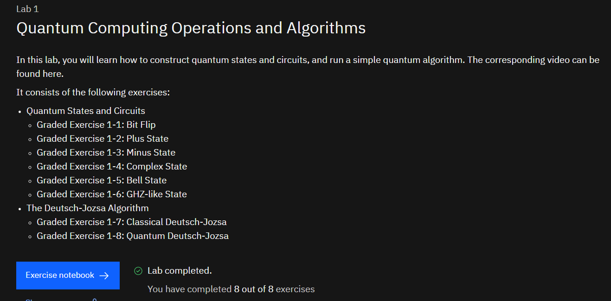
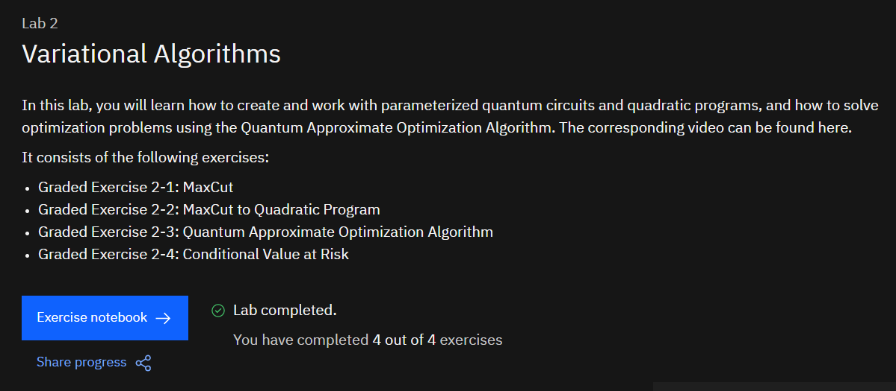
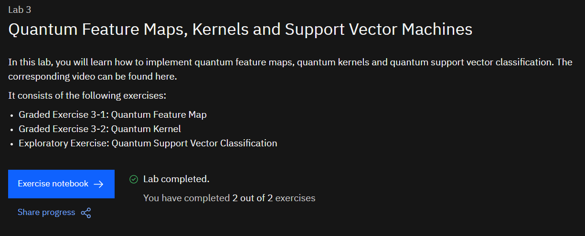
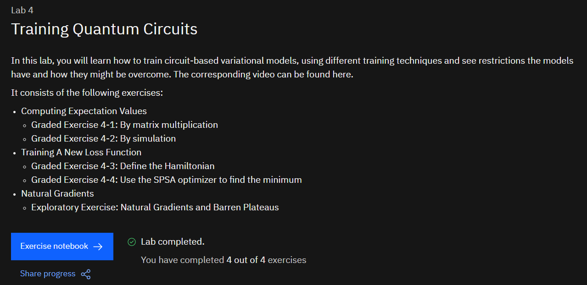
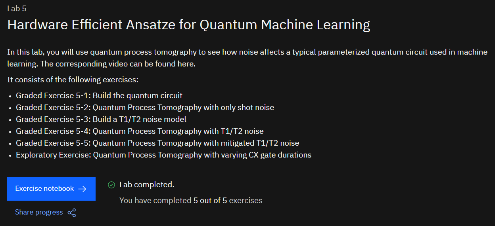

# IBM-Quantum-Machine-Learning-2021
Lab work of IBM Quantum Machine Learning 2021

---

| Lab-1 | https://quantum-computing.ibm.com/jupyter/user/quantum-challenge/2021-qgss/lab-1/lab-1.ipynb |
| ----- | ------------------------------------------------------------ |

---
---

| Lab-2 | https://quantum-computing.ibm.com/jupyter/user/quantum-challenge/2021-qgss/lab-2/lab-2.ipynb |
| ----- | ------------------------------------------------------------ |

---
---

| Lab-3 | https://quantum-computing.ibm.com/jupyter/user/quantum-challenge/2021-qgss/lab-3/lab-3.ipynb |
| ----- | ------------------------------------------------------------ |

---
---

| Lab-4 | https://quantum-computing.ibm.com/jupyter/user/quantum-challenge/2021-qgss/lab-4/lab-4.ipynb |
| ----- | ------------------------------------------------------------ |

---
---

| Lab-5 | https://quantum-computing.ibm.com/jupyter/user/quantum-challenge/2021-qgss/lab-5/lab-5.ipynb |
| ----- | ------------------------------------------------------------ |

---

**Thanks for reading**

----

**References :**

[1] https://challenges.quantum-computing.ibm.com/qgss21
